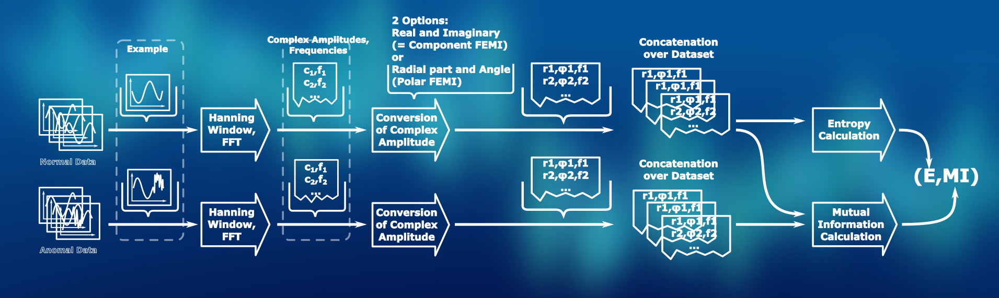
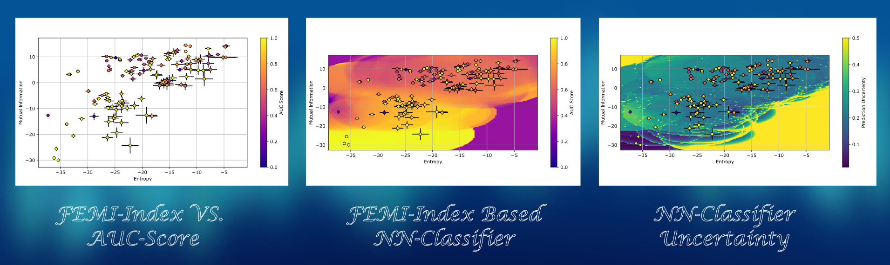

# Fourier Entropy Mutual Information (FEMI)-Index

## About This Repostory and Basic Overview:

**This repository contains experiments for a paper that is currently beeing reviewd.**
This repository contains the code to compute the FEMI-index along side experiment code for its validation. The FEMI-Index
is a way to mathematically assign and index to a time series data set. Ideally, this index gives a hint how 
difficult the calssification of the anomalies contained in the data set is for a given anomaly detection algorithm.  
this repository is structured as follow:
* A short introduction to FEMI-index is given.
* The contents of this Repository (Files and what they contain) are listed.
* How to use this repository is introduced. Including an installation guide and a step by step guide to reproduce the results that are featured in the paper.

If You are intrested in reporducing the results of out paper on this code, that is currently beeing reviewed, there is a step by step guide at the end.

## On the computation of the FEMI-index

FEMI-index is a measure to cluster or odrer data sets for time series anomaly detection. The aim here is to create an index that is associated with the difficulty to find the anomalys in the data. Further constraints are, that this index has to be easy to compute and should not requere many assumptions on the data. 
To fulfill these needs, concepts of information theory are used. The index requires to sets of data. One containing only normal data, the other one containing normal data along side anomalys.  
The entropy of the normal data is computed. By this, we are asking: "How much information is there to be learned to characterize the normal state." 
Than, the mutual information between the normal data and the data containing anomalies is created, asking: "How much informaion separates normal and abnormal states?". 
Since dooing these operations on the time domain samples would ignore the time series nature of the FEMI-index, the fourier transform of normal and abnormal data is taken and the fourier transformed data is used for the experimnts. 
The calculation is depicted in the following flowchart: 

## Contents of this repository

This repository uses some conventions and objects defined in our other repository: https://github.com/Arn-BAuA/TimeSeriesAEBenchmarkSuite.
It is used as a submodule to source data sets, models and the framework for the experimentation.  
The main computation of the FEMI-index is done in "FEMIDataIndex.py". 
### The Benchmark Experiments
The ModelComparisonBenchmark.py is a scipt that coordinates a huge benchmark of multiple models on multiple datasets. Be carefull when running it. Since extended information is logged for every experiment (e.g. examples where the trained algorithm performed good or bad on along side model weights), the data generated here can easily exceed hundrets of gigabytes storage.
### The ExperimentClass:
To Evalueate the FEMI-Index, several experiments can be run using this repository. Some of them rely on the abstract interface defined in "ExperimentClass.py". It provides functionality that handles the iteration over the benchmark data and the management of the experiments, in addition to a generic plot script to viusalize the results. To conduct the experiments using this interface, a "set dispenser" method. THat is a lambda function that needs to be specified when implementing the interface. It outputs the datasets for the experimentation. 
The experiment class also defines a default command line interface for calling experiments.
### Subclasses of the Experiment Class:
There are some subclasses implementing the interface provided by the experiment class. They are stored (along other experiments) in the Experiment subfolder. In addition, a blank experiment is stored in the folder in the file "blank.py" for You to implement your own once. 
#### Noise.py
Noise.py is an experiment that floods the data with noise and evaluates how the FEMI-Index changs with noise
#### Stability.py
This experiment averages the data with multible window lengths for the averaging. The influences on the FEMI-Index are evaluated.
### Other Experiments in the Repository
There are other experiments in the repository that don't conform to the interface. For the future, it is planned to migrate everything to be conform to a common interface, but for now we document them as is:
#### Experiments/AUCScorePlots
This experiments associates the AUC-Scores from the ModelComparisonBenchmark.py with the FEMI-Indices of the datasets using baselines that where recorded by the ExperimentClass. In addition, it saves these associataions as .csv.
#### Experimetns/FEMI-Evaluation.py and Experiments/NoiseOld.py
These are some of the first experiments which will eventually be deleted, since the things they do are also archivable using newer Experiments, that implement the "ExperimentClass" interface.
###The NN-Classifier:
To investigate the performance of the FEMI-Index, a NN-Classifier that uses the index for model performance estimation has been developed. That classifier is compared against two baselines. The classifier, the baselines and all the experiments and plots for these are in "KNNExperiment.py". Eventually this will be refactored, to be more modular and fit the interfaces. 
Some plots of the FEMI-index and the properties of the NN-Classifier can be seen in this picture: 

## How to run the experiments

The following passages describe, how the library can be set up, and how the experiments can be executed.

### Getting the Code running on Your machine:
The requirements for this repository to run are the same as for the benchmark repository (https://github.com/Arn-BAuA/TimeSeriesAEBenchmarkSuite),
 which is a submodule of this repository. The benchmark repository features an installation script, currentyl only supported for linux (We plan on going crossplattform and supporting pip and conda in the future), which sets up a virtual environment and downloads the datasets. If you are using one of the currently not supported plattforms, the shellscirpt at least duobles as an installation guide. 

### Example method calls for experiments that are derived form Experiment Class.
Since scoping in python and imports work the way they do, we decided to write some little helper scripts.
the conductExperiment.sh file is used to conduct an experiment that is stored in Experiments/\*. All that it does is copy the experiment to the root dir of the repo, run it in an interpreter and than delete the copy. This is done, so that no problems with the imports ariase when coding here. ALso meaning, that, when writing on a experiment file, all imports are specified from the root dir. 

To Plot AUC-Score form benchmark results and FEMI-Index Calculation:
<pre><code>
./conductExperiment.sh AUCScorePlots.py
</pre></code>

To create Plots and Baselines for the noise evaluation
<pre><code>
./conductExperiment.sh Noise.py
</pre></code>

### Running the Experiments that lead to the Paper results:

There is a paper on the code persented in this repository that is currently beeing reviewed. Here is a step by step guide, showing, how the results discussed in the paper can be produced. 
Before You Start: The benchmark Script saves extensive information on the benchmark run, including example in and outputs and modelweights. The benchmark results may quickly comnsume significat amounts of storage capacity (in our case, the benchmark data for univariate time series data, that where sololy used in the paper where about 74 giga byte in size). Make sure, that You provide enough free storage befor you run the experiments.  
In our experimental setup, the repositorys where stored alogn side in a common parent dictionary and the benchmark repository was included as a symbolic link, that is visible in the versions of the repository in question. How ever, if You use git to initialize the sub modules it just copys the benchmark repository at the place of the symbolic link. Don't forget to setup the submodules in the benchmark repositro as well, since the entropy estimation submodule by Marín-Franch et al. (https://github.com/imarinfr/klo) is included there. That is a remand from the time where the FEMI-prototyping was in the benchmark repository instead of its own. 
The benchmark results where archived with the benchmark repository at commit 12837a227612667a60843f6b80dcf2be51566e80. The FEMI-index repository was developed during the condution of the experiments. The repository at commit b84082f1b6d5d7882a96476f73fd5cb22bb956e7 is capable of reproducing the results shown in the paper.
Use the
<pre><code>
git checkout \*commitID\*
</pre></code>
command to bring the repositorys at that state. 
To store the result, the scripts expect some folders to be present: 
<pre><code>
mkdir HugeBenchmarkResults #for the results of the benchmarks
mkdir TestPlots #for the plots
mkdir TestResults #for the results, except benchmarks
</pre></code>
Now, run the following command, to conduct all benchmarks for univariate time series: 
<pre><code>
python ModelComparisonBenchmark.py 1 #The argument is the dimension of the time series data.
</pre></code>
This may take some time. On our system (Processor: i7-12700H, RAM: 64 GB, GPU: GeForce RTX 3080 Ti Mobile) it took about 151 hours to run (We identified some bottlenecks. Improving this run time is left for the future work on the benchmark repository.). 
Unfortunately, to record the baselines for the FEMI-index of the datasets, either the noise.py or the stability.py experiments has to be run. (We did not implement a stand alone version to compute just the FEMI-index.)
<pre><code>
./conductExperiment.sh Noise.py
</pre></code>
Running this takes approximately two additional hours. 
Now the FEMI-Indices can be associated with the benchmarked AUC-Scores using:
<pre><code>
./conductExperiment.sh AUCScorePlots.py
</pre></code>
This also generates the CSV-Files needet by the nearest neighbor classifier. 
All experiments that execute and evaluate the nearest neighbor classifier are in the KNNExperiment.py file. Unfortunately, it doesnt feature a good way to make everything accsessibel without editing the file. The calls for the experiments are directly written in the script. Some of them are commented out, others are active. To run the experiment, uncomment the method calls for the experiments You want to use and run:
<pre><code>
python KNNExperiment.py
</pre></code>
The interesting sections to comment in our out are: 
lines 328-225 for the FEMI-index, generalisation and uncertainty plots that can be seen in the paper. This takes about 1 to 2 hours to run. 
lines 531-537 for the boxplots and the MSEs saved as .csv 
At the bottom of the script are the calls to generate the latex tables used in the paper. The .csv files from the boxplot experiment are required for this. The used one are the once that are not commented out. 
In Addition, the first two Experiments require some folders to be created:
<pre><code>
mkdir TestPlots/KNN #For the FEMI,Generalisation and uncertaity plots
mkdir TestPlots/KNNBoxplots #For the Boxplots
mkdir TestResults/MSE #For the csv files with the MSE.
</pre></code>

## Shameless Plug
If You liked this repository, You might also like our benchmark repository. A huge part of the infrastructure used here is defined in there. It may also help You in Your next work: 

https://github.com/Arn-BAuA/TimeSeriesAEBenchmarkSuite

